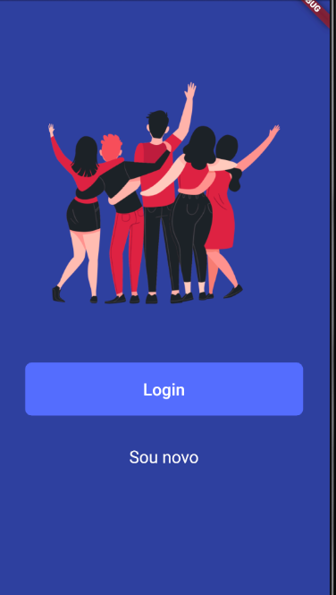
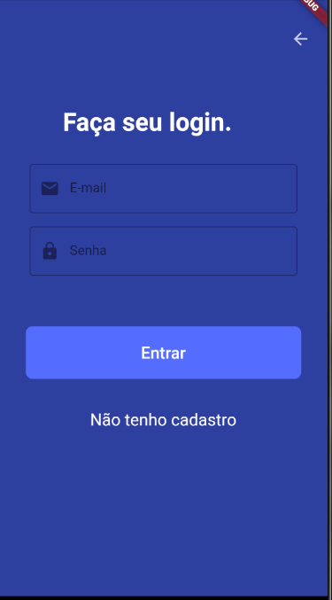
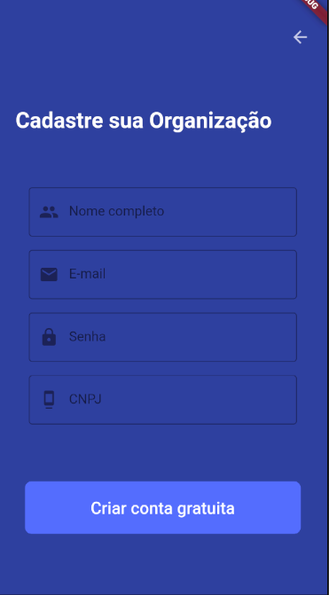

# AJUDA AÍ
 

 
## Sobre o Projeto

O <strong>Ajuda aí</strong> foi desenvolvido com o objetivo de juntar pessoas que querem ajudar com pessoas que precisam de doações!

## Techs :rocket:

- Flutter - Utlizado no mobile
- Node.js - Utilizado no front-end
- Express - Servidor utilizado juntamento com o Node.js
- Sequelize - ORM utilizado juntamente com o banco de dados Postgres
- Docker - Execução do “conteiner“ com Postgres

 

## Executando o projeto

### Pré-requisitos

Para executar este projeto em uma máquina local, é necessário estar de preferência em um ambiente Linux com os alguns softwares já instalados: Git, nodeJS, Yarn, Docker e FLutter. Para instalação dos softwares consulte: [Instalação Git](https://git-scm.com/book/pt-br/v2/Come%C3%A7ando-Instalando-o-Git), [Instalação NodeJS](https://tecadmin.net/install-latest-nodejs-npm-on-ubuntu/), [Instalação do Yarn](https://yarnpkg.com/lang/en/docs/install/#debian-stable) e [Instalação do Flutter](https://flutter.dev/docs/get-started/install).
Abaixo estão os passos para instalação do docker (para rodar o banco de dados):

1. instalar o Docker
<pre><code> $ sudo apt install docker.io</code></pre>

2. Instalar uma versão especifica do Docker 
<pre><code> $ docker run --name database -e POSTGRES_PASSWORD=docker -p 5432:5432 -d -t postgres:11 </code></pre>

## Executando no servidor local

1. Deve-se clonar este repositório com o seguinte comando:

<pre><code> $ https://github.com/Hackathon-FGA-2020/Desafio-2-Grupo-5.git </code></pre>

2. Entre no diretório do projeto:

<pre><code>$ cd Desafio2-Grupo-5</code></pre>

3. Entre no diretório do backend:

<pre><code>$ cd backend</code></pre>

4. Faça a instalação das dependências do projeto:
<pre><code>yarn install</code></pre> 

5. Crie o banco de dados
<pre><code> $ npx sequelize db:create </code></pre>

6. Criar magrations:
<pre><code> $  npx sequelize db:migrate </code></pre>

7. Inicie a aplicação com o seguinte comando:

<pre><code>$ yarn start</code></pre>

8. Acesse a página através de um browser:
<pre><code>http://localhost:3000</code></pre>

## Executando mobile

1. Inicialize seu emulador Android

2. Entre no diretório do projeto:

<pre><code>$ cd Desafio2-Grupo-5</code></pre>

3. Entre no diretório do mobile:

<pre><code>$ cd mobile</code></pre>

4. Faça a instalação das dependências do projeto:
<pre><code>flutter pub get</code></pre> 

5. Crie o banco de dados
<pre><code> $ flutter run </code></pre>

